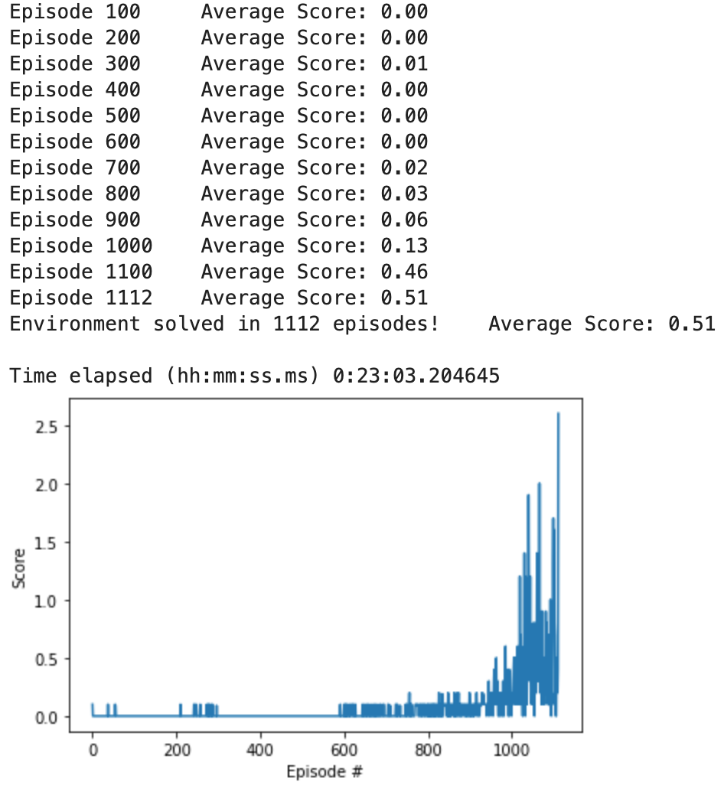
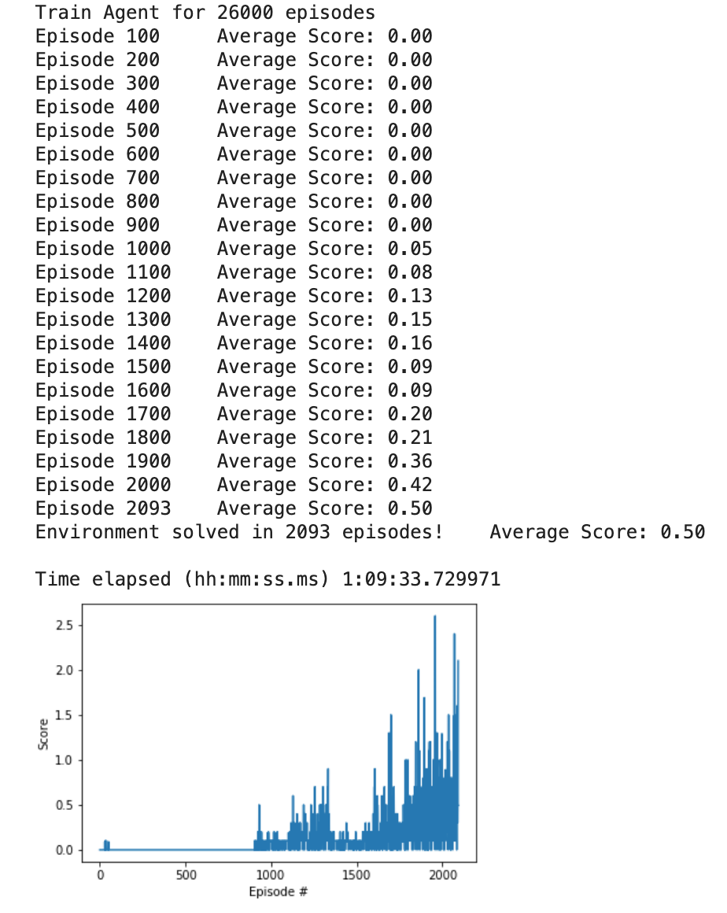

<!-- s -->

# Technical Report

## Learning Algorithm
The project implements [Deep Deterministic Policy Gradient](https://arxiv.org/abs/1509.02971) (DDPG), an actor-critic, model-free algorithm that can operate over continuous action spaces. The algorithm was used to solve the [Tennis Unity Environment](README.md), where two agents (raquets) are tasked to keep the ball bouncing across a tennis court. 

## Methodology
First of all, it is important to notice that the environment rewards the agents for keeping the ball bouncing rather than winning a game. This means the two trained agents should collaborate, rather than compete. Secondly, each agents receives local coordinates making the environment and the two agents completely symmetrical with respect to the y axis (or the "net", where x=0).

With these premises, I trained a DDPG model where both agents share the same experience (implemented as a [prioritized experience replay](https://cardwing.github.io/files/RL_course_report.pdf)) in analogy with the previous [project](https://github.com/nlddfn/Udacity_RL_P2_CControl). Unlike the MADPG, only one actor and one critic are used for both agents.

During the first experiments, I managed to solve the environment with only 1100 episodes and a simple buffer. While exciting, I was not able to validate the minimum requirement (score > 0.5). The average reward over 10 episodes was <= 0.3. I therefore introduced PER to improve model stability. The new model was able to validate successfully with average score = 0.83.

## Hyper-parameters

| Hyper-parameter name | Value          | Detailed meaning                                      |
| :---:                |:----:          | :---:                                                 |
| Replay buffer size   | 1e6            | Capacity of the replay buffer                         |
| Mini-batch           | 1024           | Number of samples trained in each step                |
| replay_initial       | 1024           | Initial memory before updating the network            |
| update_frequency     | 2              | Update frequency for target network                   |
| FC units             | (256, 128, 64) | NN hidden layers                                      |
| Actor α	           | 1e-4           | Learning rate for gradient descent                    |
| Critic α	           | 1e-3           | Learning rate for gradient descent                    |
| weight decay         | 0              | L2 weight decay                                       |
| τ                    | 1e-3           | Soft update for target network weights                |
| γ                    | 0.99           | Discount factor                                       |
| prioritized          | True           | if True prioritized replay will be used               |
| PER_alpha            | 0.6            | Toggle prioritization: 0 - 1 (100%)                   | 
| PER_beta             | 0.4            | Toggle importance weights: 0 - 1 (full correction)    |
| PER_beta_increment   | 0.0001         | Stepwise increment to beta from initial value to 1    |
| PER_eps              | 0.0001         | epsilon to add to the errors when updating priorities |

## Plot of Rewards
Trial 1: normal replay buffer. The environment was solved in 1112 episodes. The final average reward converged to +.51.
<figure>
    
    <!-- <figcaption>Fig 2: Rewards</figcaption> -->
</figure>

Trial 2: Same agent with prioritized experience replay. The environment was solved in 2093 episodes. The final average reward converged to +.5.
<figure>
    
    <!-- <figcaption>Fig 2: Rewards</figcaption> -->
</figure>

## Ideas for Future Work
The main challenges with the DDPG approach is the unstable learning. This issue can be addressed by:
* Use parameter space noise rather than noise on action. https://vimeo.com/252185862https://github.com/jvmancuso/ParamNoise
* Use [batch normalization](https://medium.com/@kinwo/solving-continuous-control-environment-using-deep-deterministic-policy-gradient-ddpg-agent-5e94f82f366d)
* Hyperparameter tuning
* Different replay buffer for actor/critic (I read this on the course Q&A but I could not find a paper or a blog on the topic)
